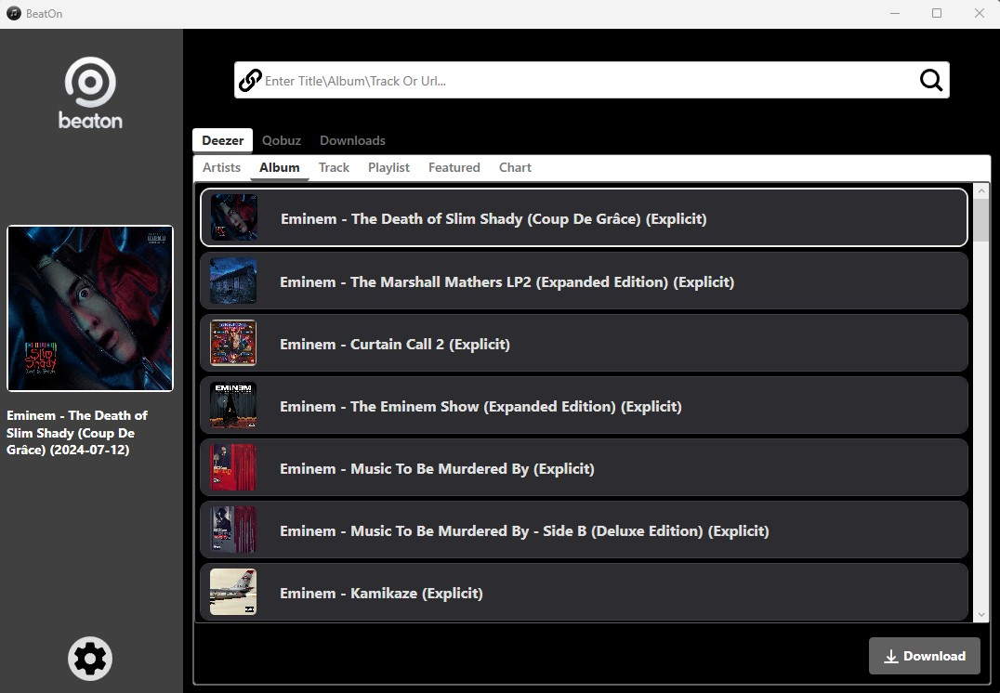
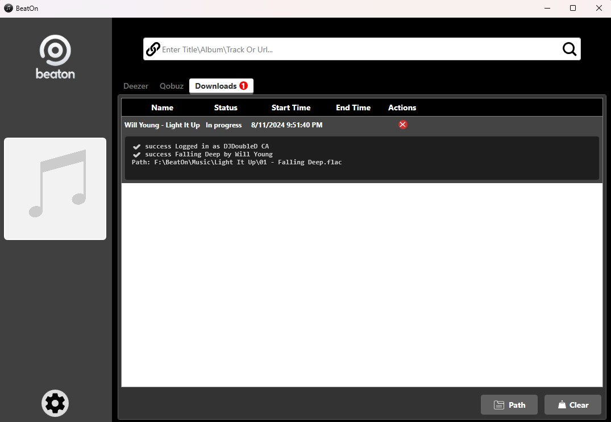
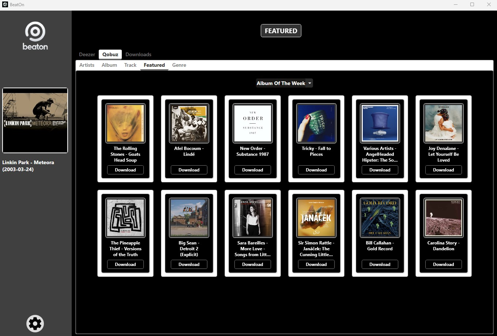
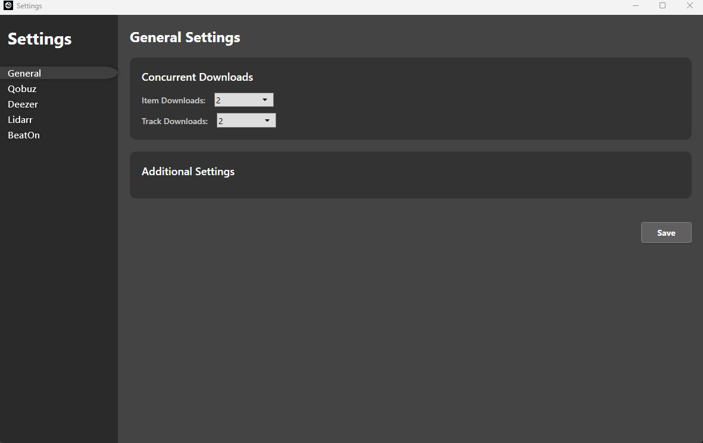
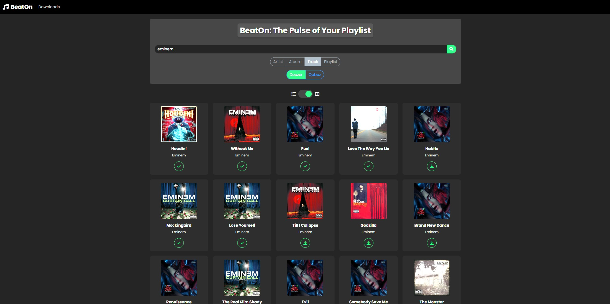
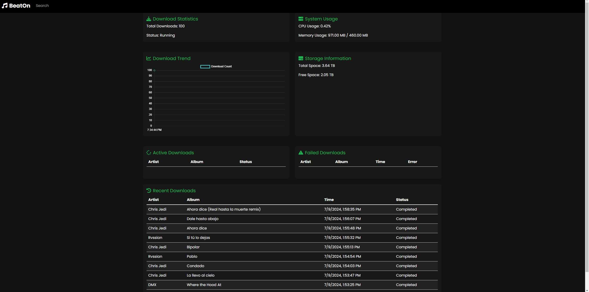

# BeatOn
Discover BeatOn, the ultimate GUI for D-Fi designed to enrich your Download experience with Deezer and Qobuz. Built using C# and WPF, BeatOn allows you to effortlessly download albums, songs, and artist catalogs.  BeatOn combines simplicity with elegance, offering an intuitive, visually pleasing interface. Download your tunes in just a few clicks.

thanks to firehawk52 for he's website 'https://rentry.co/firehawk52' where all the arl's are coming from, all credit goes to him.

##########################################################

