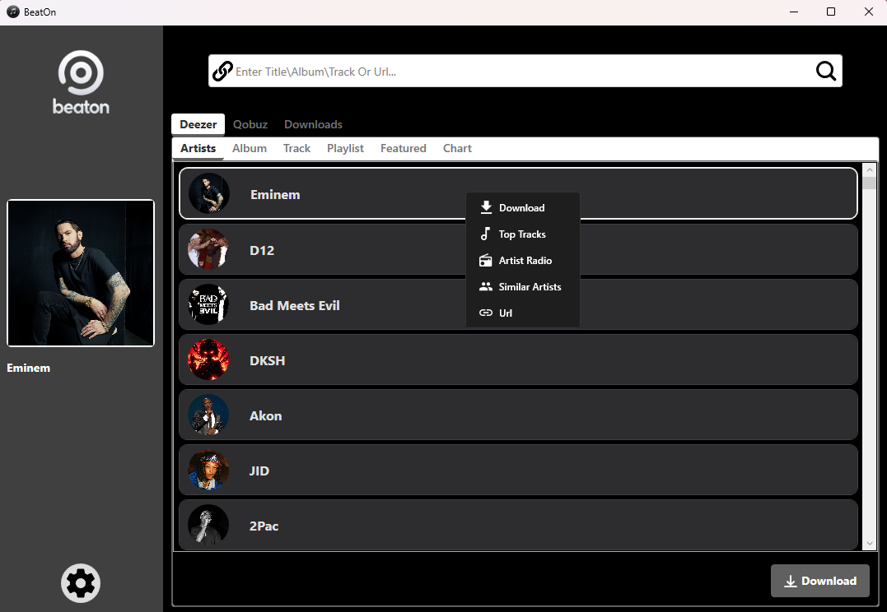
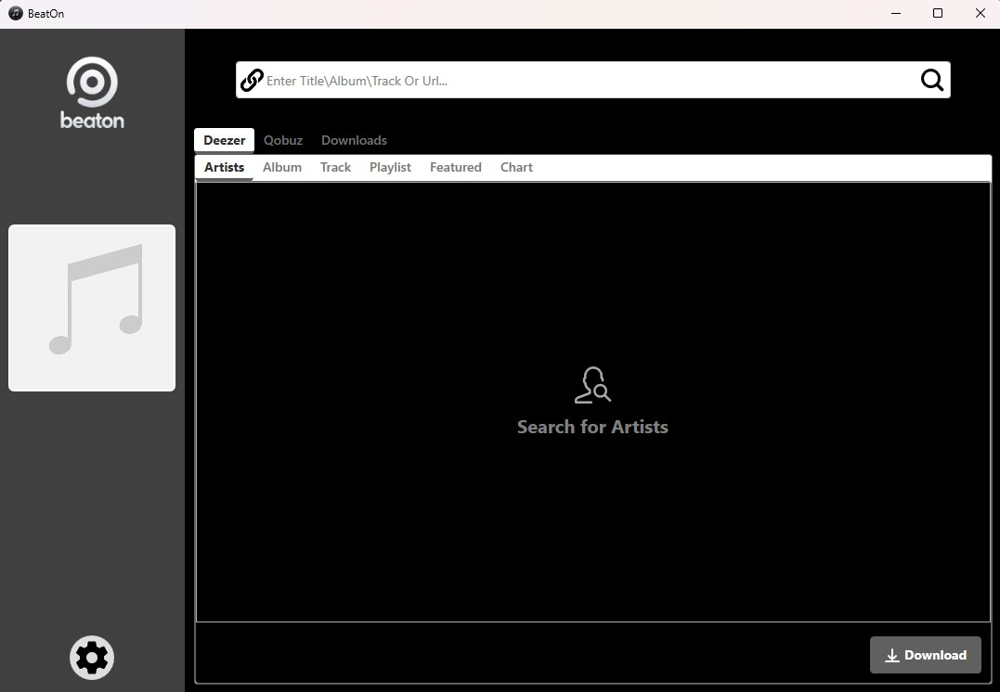
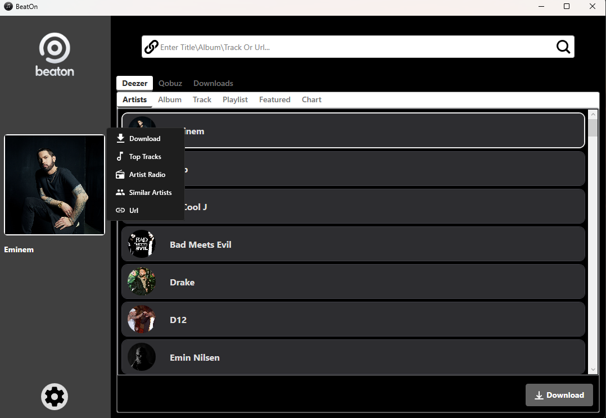
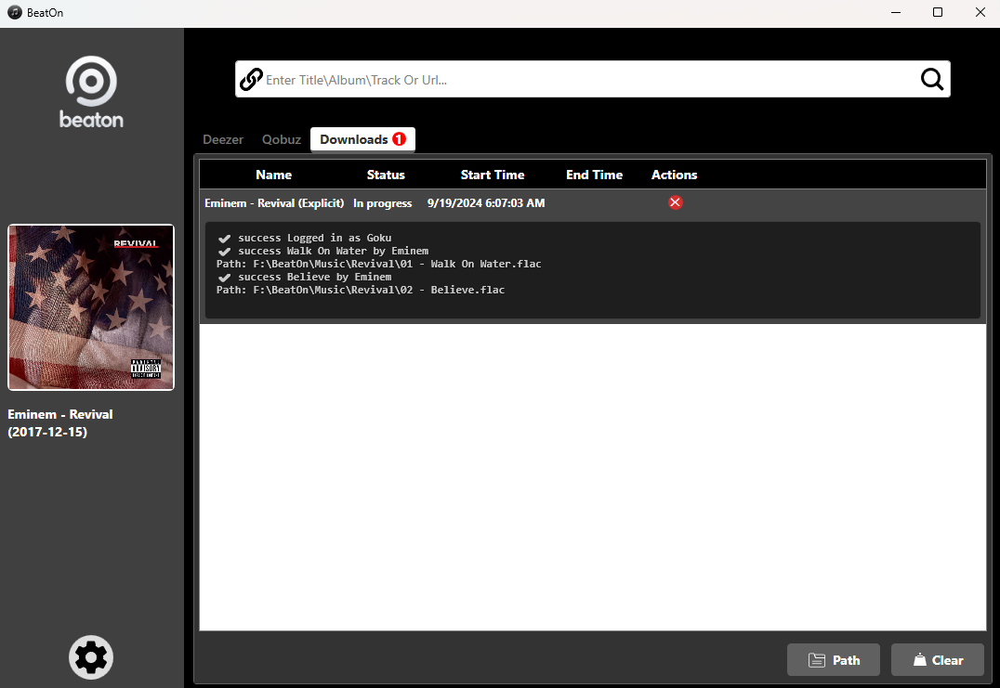
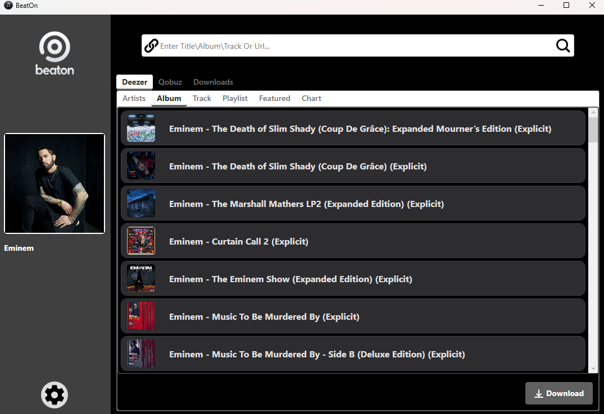

# BeatOn

BeatOn is the ultimate GUI for D-Fi, designed to enhance your download experience with Deezer and Qobuz. Built using C# and WPF, BeatOn allows you to effortlessly download albums, songs, and artist catalogs with just a few clicks.

## Features

- Intuitive and visually pleasing interface
- Easy downloading of albums, songs, and artist catalogs
- Support for both Deezer and Qobuz platforms
- Web UI for convenient access and control

## Screenshots

### Desktop Application

<table>
  <tr>
    <td></td>
    <td></td>
  </tr>
  <tr>
    <td></td>
    <td></td>
  </tr>
  <tr>
    <td></td>
    <td></td>
  </tr>
</table>

### Web UI

<table>
  <tr>
    <td></td>
    <td></td>
  </tr>
  <tr>
    <td></td>
    <td></td>
  </tr>
</table>

## Tutorials

### Download with URLs

### Artist Right-Click Context Menu

### Click to See Download Progress

### Double Click to See Items in Selection

## Credits

Special thanks to firehawk52 for providing the ARLs used in this application. Visit their website at [https://rentry.co/firehawk52](https://rentry.co/firehawk52) for more information.

## License

This project is licensed under the MIT License - see the LICENSE file for details.

---

BeatOn - Simplifying your music download experience.
